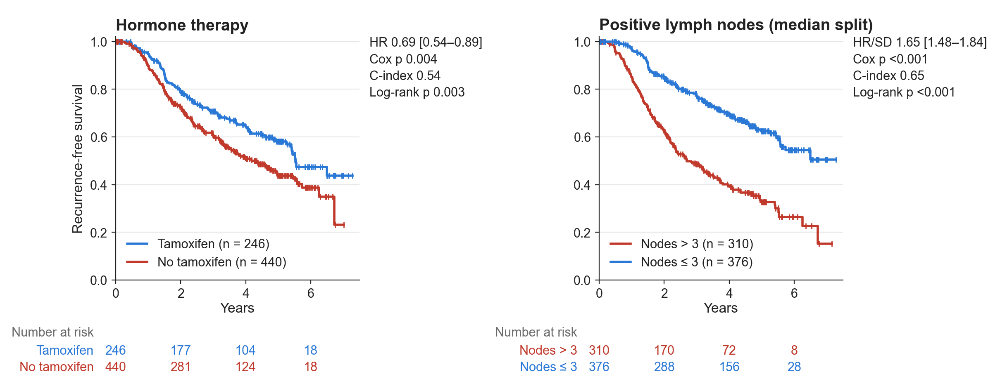
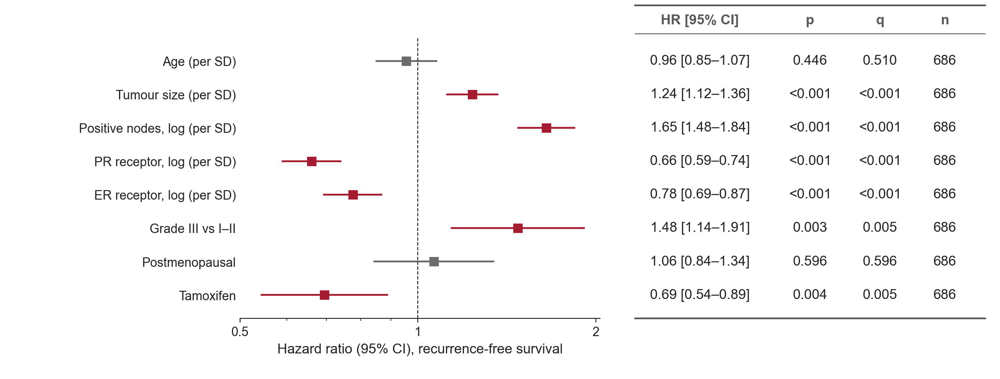
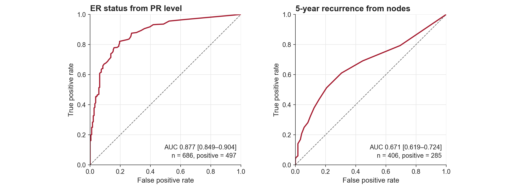
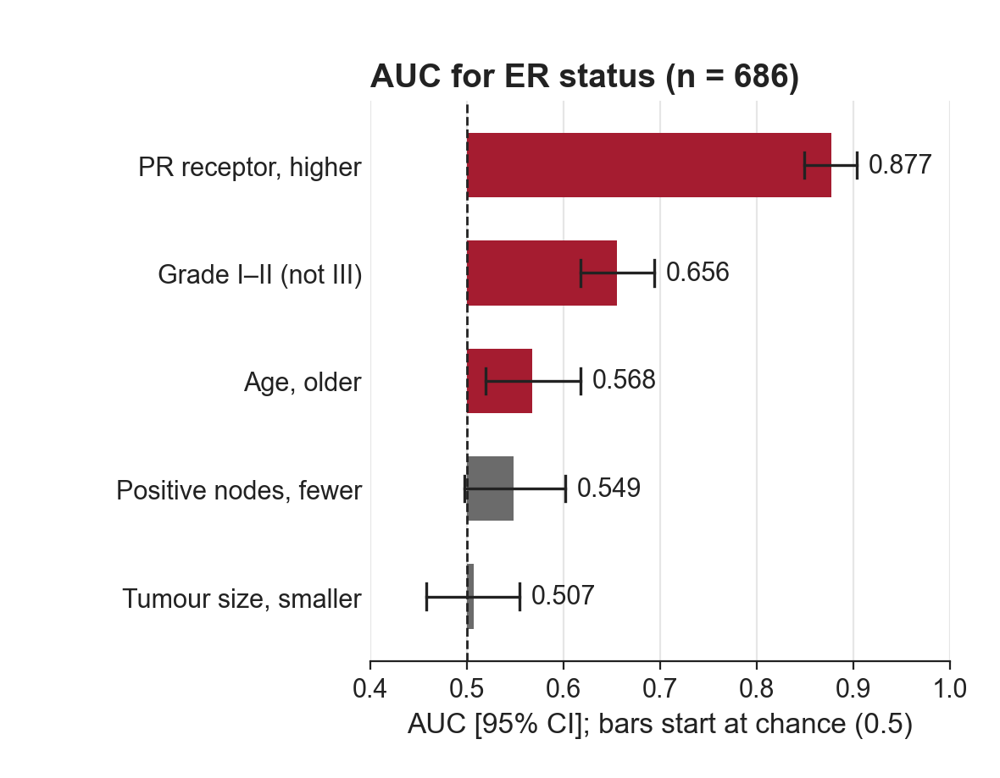

# 图

deck 和论文共用。示例图由 [examples/make_example_figures.py](../examples/make_example_figures.py) 用公开数据画出。

## 1. 按最终尺寸画

**先定版位，再画图。** `figsize` 就是图在最终页面上占的尺寸，代码里的字号就是读者看到的字号。
放置时 1:1，不缩放、不裁剪、不拉伸。

| 目标 | 版位（宽 × 高，英寸） | 字号 |
|---|---|---|
| 16:9 slide（13.333 × 7.5），标题和结论句之间整宽 | 12.1 × 4.6，上边 y = 1.1 | 正文 12 pt，最小 11 pt |
| 同上，两张并排 | 5.9 × 4.6 | 同上 |
| 同上，两行 KM 网格（上下两个终点） | 12.1 × 4.9，上边 y = 0.95 | 同上 |
| 论文单栏 / 双栏 | 按目标期刊（常见约 3.5 / 7.2） | 按期刊要求，常见 7–9 pt |

- 只有放不下 11 pt 的长列表（20 行以上的森林图、几十个类别名）才降到 10 pt。
- 结果图一律 1:1 放置。只有缩略图和外部图片会缩放显示，它们按显示后的尺寸算字号。
- 理由：先画大图再缩小，字号就各页不一；不同来源的图拼在一页上也对不齐。

## 2. 文字与字体

- 图里所有文字用英文：标题、轴标签、图例、注释、分类名。
- 给图用的标签在数据表里就写英文，不在出图时翻译。显示名的修正（拼写、大小写）集中在一个函数里。
- 字体 `["Arial", "DejaVu Sans"]`，`pdf.fonttype = 42`（PDF 里文字可编辑），`axes.unicode_minus = False`。
- 中文字体在别人机器上容易变成方框，这也是图里不放中文的原因之一。

## 3. 形状与颜色

- ROC、KM、两轴同尺度的散点画成正方形（`ax.set_box_aspect(1)`）。
- 同一张图里只要有方形面板，就都画成方形而且一样大。放不下时改成一行排列，不要缩成很小的方块。
- 只用一个强调色，其余用灰色；这个强调色的浅色调（tint）算同一个颜色。强调色只标「值得看的」（如 q < 0.05 的行），不用来区分类别。
- 类别多时用一套固定的分类色板，同一个类别在整份产出里颜色不变。

## 4. 生存分析图（适用时）

- **KM 配色按曲线位置，不按组别**：下面那条（预后差）红，上面那条蓝，三组时中间灰。
  上下按共同随访期内的 RMST 判定，曲线交叉也不会判反。
- **每个 KM 面板写四个量**：
  - HR [95% CI]（连续变量 per SD，二分类 yes vs no）；
  - Cox p；
  - 单变量模型的 C-index；
  - 所画分组的 log-rank p。
- 每组的 n 写在图例里。
- 连续变量按中位数分组画 KM 时，HR 仍报连续变量的 per-SD HR，log-rank p 报所画的分组。
- **每条 KM 曲线都画删失标记**：小竖线「|」，颜色和曲线相同。
- **每个 KM 面板下面放 number-at-risk 表**：
  - 列对齐横轴刻度（如 0、2、4、6 年），每组一行，行首写简短组名；
  - 组名和数字都用该组曲线的颜色；
  - 人数自己算（随访 ≥ t 的人数）再逐个放文字。lifelines 的 `add_at_risk_counts` 会改坐标轴尺寸，打乱固定版位。
- 加了 at-risk 表后方块变小，四个量放在面板右侧，不压在曲线上。

- **森林图**：
  - 横轴用对数，参考线 1；
  - 右侧数字栏按三线表排（见 [tables.md](tables.md)），列中心对齐；
  - q < 0.05 的行用强调色，其余灰。

## 4b. ROC 与 AUC（适用时）

- **ROC 面板画成正方形**，同一张图里的几个 ROC 面板一样大；两轴范围都是 0–1。
- 画一条虚线对角线表示随机水平（AUC = 0.5）。
- 每个面板写 `AUC 0.xxx [lo–hi]`，并写 n 和阳性数（`n = 686, positive = 497`）。
- **CI 用 bootstrap**（常用 2000 次，百分位法），随机种子和重抽样次数记进 run_meta / 统计表。
- 一个分析单位有多个样本时（如一个病人多张切片、多个 ROI），先聚合到分析单位（如每个病人一个分数）再算 AUC，
  bootstrap 也按这个单位重抽；否则 n 被夸大，CI 偏窄。

- **AUC 条形图**：
  - 条从 0.5（随机水平）起画，不从 0 起；横轴可以略低于 0.5，好让跨过 0.5 的 CI 完整显示；
  - 误差线画 95% bootstrap CI，条上标 AUC 值（3 位小数）；
  - CI 不含 0.5 的条用强调色，其余灰；
  - 方向要写明：低值对应阳性的变量，翻转方向并在标签里写清（如 `Tumour size, smaller`），或者不翻转、如实画在 0.5 以下，两种都行，但要说清用的是哪种；
  - 较少的一类不到 5 例时不画条，在该行写「not evaluable」；
  - 有内部测试集 AUC 时，可以加一条虚线参考线标出它。

## 5. 示意图与框架图

- 箭头分层：
  - 处理带内部的步骤之间，用细灰线箭头；
  - 带外面表示输入输出的流向，用粗的强调色箭头。
- 多行共用同一个输入或输出时，只画一个箭头指向中间，不要每行一个。
- 小图、图标各自是独立的图片对象，文字用原生文本框，不要拼成一整张图。这样以后能在 PowerPoint / Illustrator 里单独改。
- 图标和论文原图只用开放许可的，并登记出处和许可（见下）。

## 6. 图标与外部图片

| 来源 | 许可 | 注意 |
|---|---|---|
| [Health Icons](https://healthicons.org)（[GitHub](https://github.com/resolvetosavelives/healthicons)） | CC0 | 可直接用，不必署名；示例在 [examples/icons/](../examples/icons/) |
| [Lucide](https://lucide.dev) | ISC | 上屏不必署名；再分发源文件时保留 LICENSE |
| [Tabler Icons](https://tabler.io/icons) | MIT | 上屏不必署名；再分发源文件时保留 LICENSE |
| [Servier Medical Art](https://smart.servier.com) | 看文件从哪里来：Servier 网站上的是 CC BY 4.0，经 Bioicons 转发的 Servier 文件是 CC BY 3.0 | 必须署名；按该文件自己的许可写 |
| [Bioicons](https://bioicons.com)（[GitHub](https://github.com/duerrsimon/bioicons)） | 逐个图标不同（CC0、CC BY、CC BY-SA、MIT、BSD） | 用前看该图标的许可；CC BY-SA 会要求衍生作品同许可 |
| [NIH BioArt](https://bioart.niaid.nih.gov) | 免费使用，要求署名，个别条目许可不同 | 署名格式：`Illustration from NIAID NIH BioArt Source (bioart.niaid.nih.gov/bioart/###)` |
| 论文原图 | 只用 CC BY / BY-NC / BY-NC-ND | ND 不允许改编；裁切是否算改编有争议，保守做法是原样使用；在大纲里登记出处和许可 |

- SVG 留作母版（论文用图、在 Illustrator / Inkscape 里改）。slide 用 512 px 的 PNG：LibreOffice < 7.4 画不出 pptxgenjs 嵌的 SVG，预览会不对。
  matplotlib 不能读 SVG，要用时同样先转成高分辨率 PNG。
- 每个用到的外部图片都在项目里登记：来源 URL、许可、是否修改过。

## 7. 工程约定

- 画图脚本只读结果表，不做分析。图有问题回画图脚本改，不在 deck 或排版软件里修。
- 每张图一个注册名（`FIGURES = {"km_example": fig_km, ...}`），入口支持 `--only <名字>` 只画几张，
  每张图写一份 `run_meta/<图名>.json`，并行画图不会互相覆盖。
- 平时只用 `--only` 画改过的那几张，不要每次整套重画。
