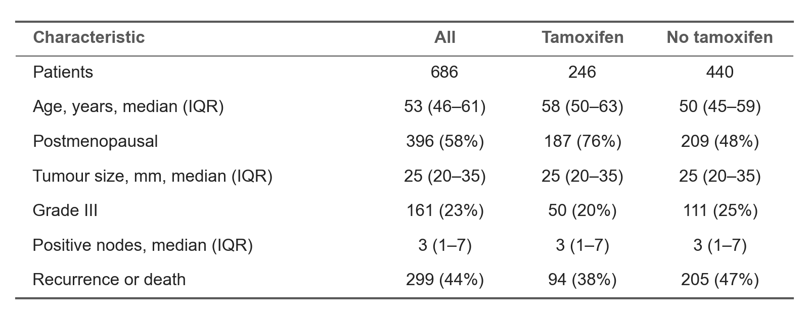

# 表格：三线表

产出里的表格（slide、图、论文、报告）都用三线表：deck 的原生表格、画进图里的表、森林图右侧的数字栏、论文表格。只有用户特别说明时才例外。
本仓库文档里的 markdown 表格不在此列：markdown 画不出三线表。

## 规则

- 只有三条横线：顶线（粗）、表头下线（细）、底线（粗）。不画竖线、内部横线，也不填底色。
- 第一列左对齐；其余列居中，表头和下面的数值共用同一个列中心。
- 表头加粗，字号和正文一样。分组标签行可以用强调色加粗，横跨整行写，不挤在第一列里折行。
- 数字格式按 [numbers-and-sources.md](numbers-and-sources.md)：同一列小数位数一致，区间用 en dash。



## 实现

**matplotlib**（画进图里的表）：
- 用 `ax.text` 摆字：第一列 `ha="left"`，其余列 `ha="center"`。
- 再画三条横线：顶线 / 底线 1.5 pt，表头下线 0.75 pt。
- 横线和文字要用同一套坐标，并固定 `xlim` / `ylim`；否则 `plot` 会把数据范围撑变，文字跑到画面外。
- 完整例子见 [examples/make_example_figures.py](../examples/make_example_figures.py) 的 `fig_table()`。

**pptxgenjs**（deck 原生表格）：逐格设边框，`border: [top, right, bottom, left]`：

```js
const none = { type: "none" };
const outer = { type: "solid", pt: 1.5, color: "595959" };  // top and bottom rules
const mid = { type: "solid", pt: 0.75, color: "595959" };   // rule under the header
// row i of rows[0..last]; set the header rule on BOTH cells of the shared edge,
// otherwise some renderers let the blank edge win.
const top = i === 0 ? outer : i === 1 ? mid : none;
const bottom = i === last ? outer : i === 0 ? mid : none;
options = { align: j === 0 ? "left" : "center", valign: "middle", border: [top, none, bottom, none] };
```

另外显式传表框高度 `h`，取各行行高之和；不传的话 pptxgenjs 写出 1 in 的表框。

**LaTeX**：`booktabs` 宏包，`\toprule`、`\midrule`、`\bottomrule`，列格式 `l c c c`，不用 `|` 和 `\hline`。

**Word / docx**：表格边框只留表头上下边和最后一行下边，其余设为无；第一列左对齐，其余列居中。
