**English** | [简体中文](slide-types.zh-CN.md)

# Slide geometry and slide types

16:9, 13.333 × 7.5 in (pptxgenjs `LAYOUT_WIDE`). All coordinates are in inches, with the origin at the top left.
The numbers in §1 are the defaults of the neutral theme, [themes/neutral/theme.json](../engine/themes/neutral/theme.json) (the field named in each row); page files read them through `P.T` / `P.G` and never write them out. The per-type numbers in §2 come from the example page files ([results](../../../examples/slides/results/slides/), [narrative](../../../examples/slides/narrative/slides/)).
With a different template, generate the theme with `theme_from_pptx.py` or measure the template and replace the values in its theme.json, but keep the top-to-bottom order of the regions and their spacing relationships.
The layout diagram of each slide type sits under that slide type in §2 (`examples/figures/layout_*.png`, drawn to scale).

## 1. Geometry

| Element | x | y | w × h | Font and style |
|---|---|---|---|---|
| Margin / content width (`geometry.margin`; `G.contentW`) | 0.6 / — | — | content width 12.133 | — |
| Title (`geometry.title`) | 0.59 | 0.36 | 9.6 × 0.6 | 28 pt bold, gray (e.g. `595959`), title font; top left, ends left of the logo |
| logo (`geometry.logo`) | 10.98 | 0.2 | 2.0 × 0.35 | Top right, a generic placeholder box; when replaced with an institutional logo, use the box measured from the template; with no logo, leave it empty and don't move other elements |
| DRAFT label (`geometry.draft`) | 10.683 (= 13.333 − 2.65) | 0.66 | 2.35 × 0.32 | Light gray fill, thin gray border, 12 pt bold mid-gray, centered: `DRAFT – to be confirmed` |
| Main figure, full width (`geometry.figureTop`, `full`) | Centered (≈ 0.617) | 1.1 | 12.1 × 4.6, ends at 5.7 | Placed at native size: w = pixel width / dpi, h = pixel height / dpi |
| Conclusion box (`geometry.conclusion`) | 0.7 | 5.75 (below a figure) / 5.95 (no figure) | 11.933 × 1.05, ends at 6.80 with a figure | 18 pt bold black, top-aligned; fits 3 lines |
| Conclusion list (`conclusion.indent`, `after`) | Same as above | Same as above | Same as above | Hanging indent 22 pt (0.3 in) per item, 10 pt space after |
| Source line / references (`geometry.source`) | 0.6 | ≥ 6.82 | 11.683 × 0.6 | 9 pt serif, near-black, right-aligned, bottom-aligned (text lands at about 7.1–7.4); journal names in italics |
| Page number (`geometry.page`) | 12.363 | 7.0 | 0.6 × 0.3 | 12 pt gray, right-aligned, right next to the source line |
| Abbreviation line (`geometry.abbr`) | 0.6 | 6.85 | 6.0 × 0.55 | 9.5 pt mid-gray, `ABBR: ` in bold; bottom left, bottom-aligned on the row of the source line; options of `P.abbr()` move it |

- **Body bullets** (`geometry.bullet`): single line spacing, 0 space before, 8 pt space after; 10 pt space after when the font size is ≥ 18 pt. Default hanging indent 16 pt.
  Line spacing and space before are never set individually; they are the same across the whole deck.
- **Slides without a main figure** (text slides, summary slides) put the conclusion box at y = 5.95 (`G.conclusion.yText`); slides with a figure put it at 5.75 (`yFigure`, the default of `P.conclusion()`), right below the figure.
- **If the conclusion sentence is too long**, split it into a bullet list; don't shrink the font (reason: the conclusion font size is the same on every slide).
- **Colors** (`color` in theme.json, `P.T.color` / `P.C`): gray for titles and body text, near-black (`222222`) for table and card text, mid-gray (`7F7F7F`) for secondary text, light gray (`D9D9D9`) for thin lines,
  light gray (`F3F3F3`) for card fills, a white background, plus **one** accent color (the main color of the template or institutional logo; `A51C30` in the neutral theme is only a placeholder, replace it with the template's main color).
  Lighter tints of this accent color (`color.accentTints`, `C.accent2`–`C.accent4`) count as the same color. The accent color is only for step-card headers, group labels
  and numbers to emphasize, never to distinguish categories.
- **Fonts** (`font.display`, `font.body`, `font.serif`): titles use the template's display font, body text the template's sans-serif font, source lines and references a serif font. They are theme fields; page files don't set them themselves (build.js warns about font names and color literals in page files).
- **Figure dpi** is the theme's `dpi` (200), read on both the plotting side (`plotting/style.py`) and the build side (`P.figure()`): the build computes the placed size as "pixels / dpi", and if the two sides differ, the figure gets scaled.
- **z-order**: after the main figure is added, `P.figure()` sends it to the bottom of the slide ("send to back"); several figures on one slide keep their order relative to each other. Then a title that wraps to two lines in another font is not hidden by the figure.
  Icons on cards, small step images, the logo and other images that are meant to sit on top of shapes are left alone.

## 2. Slide types

primitives.js provides the elements the slide types are built from (`newSlide`, `figure`, `conclusion`, `table`, `titleFrame`, `stepArrow` …); each page file `slides/<key>.js` places them and fills in the content. A layout shared by several pages goes into the deck's `slides/_lib/` as a function that each page file calls, and is merged into primitives.js by the integrator after it has been used twice.

### Title slide / closing slide

- **Use for**: the first slide (title, speaker, date); the closing slide (`Thank you`) uses the same frame.
- **Layout**: logo at the top left; the title centered in a horizontal band, with a thin vertical accent-color bar on its left (about 0.1 × 1.86 in),
  and a thin full-width accent-color line at the bottom of the slide (about y 6.83, height 0.05); speaker and date right-aligned below the title (`geometry.titleSlide`, drawn by `P.titleFrame()`).
- **Rules**: the speaker's name appears only here (and as authors in references). The title may take two lines, using a soft line break, not two paragraphs. These two slides are built with `P.newSlide(pres, "Title", n, {chrome: false})`: no topic title and no page number on the slide, but they still count in the page numbers of `pages.json`; their titles are recorded as `Title` and `Thank You`.

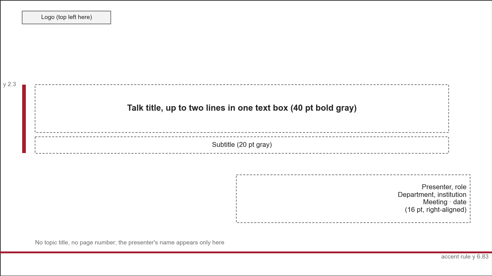

### Figure + conclusion (most common)

- **Use for**: one full-width result figure (forest plot, KM, heatmap, bar chart).
- **Layout**: title → main figure (y 1.1, native size, centered) → conclusion box (y 5.75) → source line → page number; ⚠️ slides get the DRAFT label.
- **Rules**: draw the figure at 12.1 × 4.6 in (see [figures.md](../../../shared/figures.md)). If a wrapped title runs into the figure, move the figure and conclusion box down together with the `y` argument of `P.figure()` and `P.conclusion()`;
  don't shrink the figure. Of the numbers already written in the figure, the conclusion sentence picks only one or two.

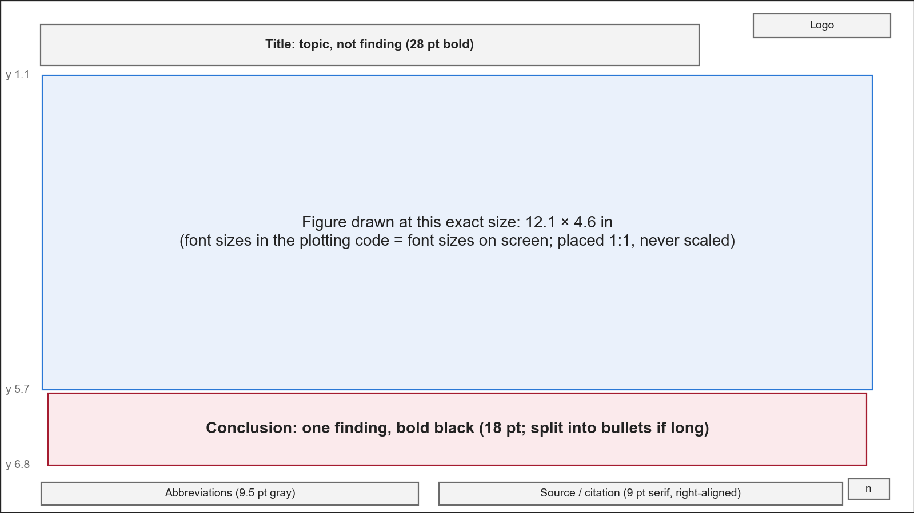

### Two figures side by side

- **Use for**: two views of the same question (two endpoints, two models), compared left and right.
- **Layout**: each figure drawn at 5.9 × 4.6 in (`geometry.half`), 0.2 in apart (`geometry.gap`), centered horizontally as a group, both at native size.
- **Rules**: both figures have the same height, font size and axis ranges (where they can be aligned); don't shrink a full-width figure to half width.

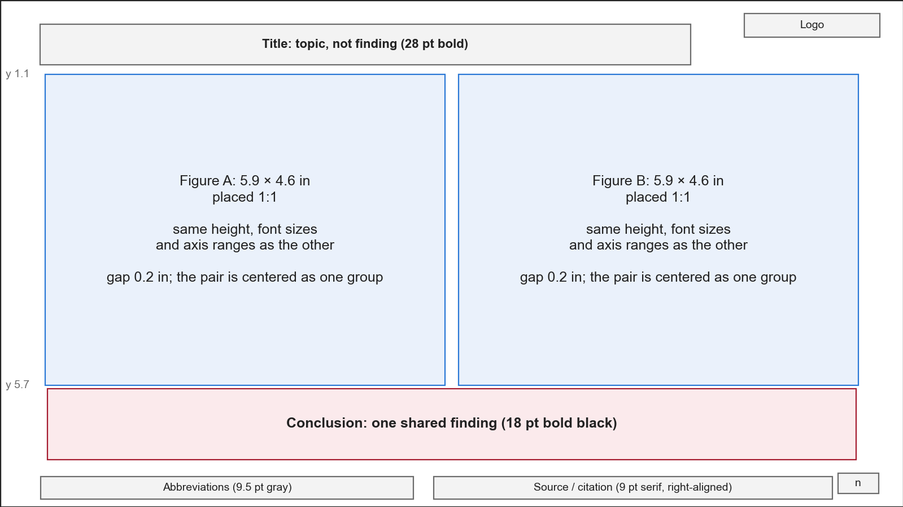

### KM grid (two rows of endpoints)

- **Use for**: the same set of variables against two endpoints (e.g. PFS in the top row, OS in the bottom row), one variable per column.
- **Layout**: the figure starts at y 0.95 and is 4.9 in tall (0.3 in more than a full-width figure); the conclusion box moves down to y 5.87.
- **Rules**: all panels are squares of the same size, and both rows share one x-axis range; each cell shows HR [95% CI], Cox p, C-index and log-rank p
  (see [figures.md](../../../shared/figures.md) §4). The title must fit on one line, otherwise it runs into the figure.

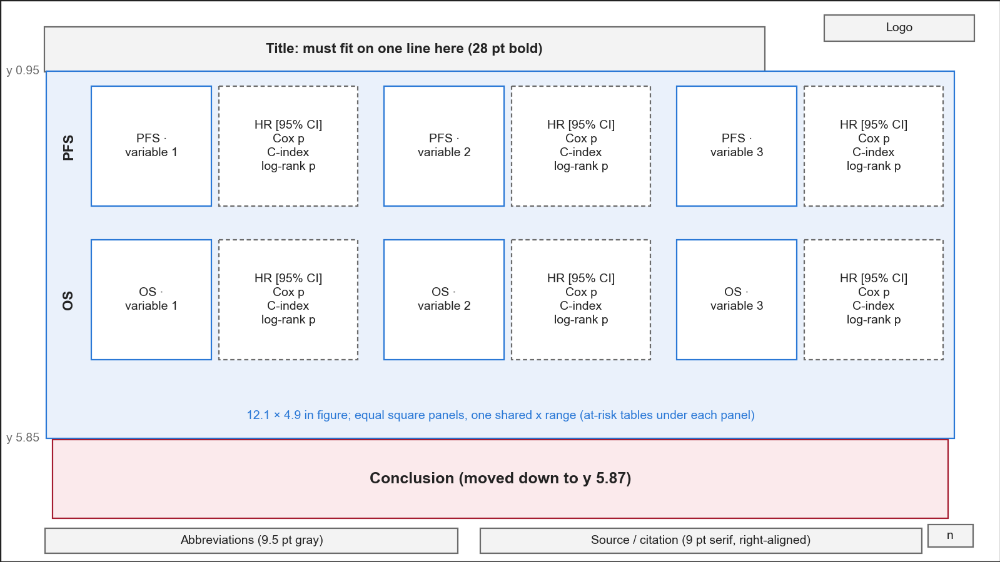

### Methods flow

- **Use for**: methods, processing pipelines, model training steps.
- **Layout**: one row of step cards, 0.32 in apart, with a small right-pointing arrow (0.24 in tall, `P.stepArrow()`) between them.
  Each card: an accent-color header (0.42 in tall, white 14 pt bold `1 · Step name`) + a light-gray body (13 pt near-black, 6 pt space after).
  Card row at y 1.3, height 2.3; below it, bullets with definitions and caveats (y 3.85, 14 pt); conclusion box at the bottom.
- **One image per step (optional)**: draw one figure as wide as the card row, one small image per cell (ideally the same sample through all steps),
  placed at native size between the card headers and bodies; the card row becomes y 1.05, height 3.95, body 12 pt with 3 pt space after, and the bullets move down to y 5.05.
- **Rules**: 3–5 steps; each step's body says "what was done + key parameters", not results; results are left for the result slides that follow.

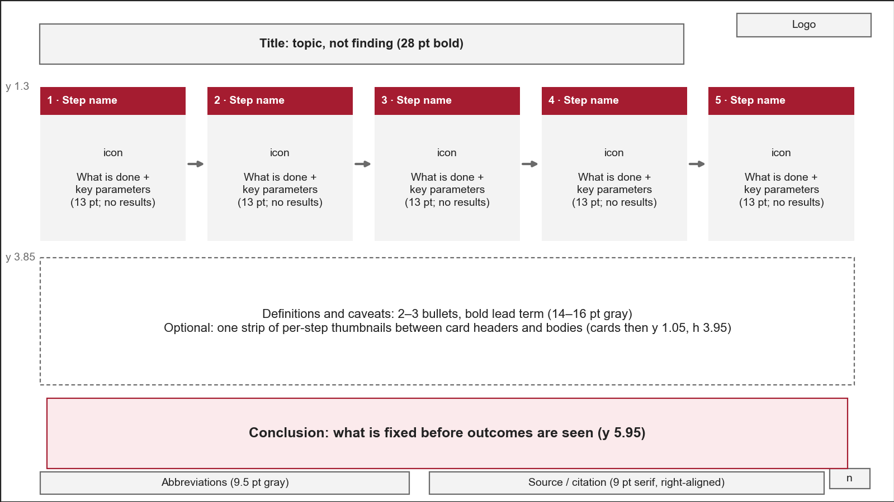

### Feature definition table

- **Use for**: the first time a group of features appears, to tell the audience how each feature is computed and what high and low values mean.
- **Layout**: a three-line table starting at y 1.05, with columns

  | Feature | Low → high | What is computed (unit) | Higher value | Lower value | HR > 1: shorter survival with |
  |---|---|---|---|---|---|

  The second column holds a small schematic per feature (low value on the left, high value on the right), all drawn at the same size by the plotting module and placed as separate images over the cell;
  they are scaled down proportionally only if the cell can't fit them (these small schematics count as thumbnails, placed with `P.fitImage()`; result figures are never scaled). The last column's header is reworded for the endpoint.
- **Group rows**: insert an empty row in the table, then lay a text box spanning the whole row over it, with the group name in bold accent color (not squeezed into the first column and wrapped).
- **Row height**: estimated by greedy line wrapping of each cell's text (character widths taken from the wider substitute font, bold about 18% wider again), then the larger of that and the icon height,
  so every icon lands in its own row in both renderers. Table frame height = sum of row heights.
- **Rules**: there may be one line of 12 pt mid-gray explanation below the table; the conclusion sentence says "what question this group of features answers", not results.

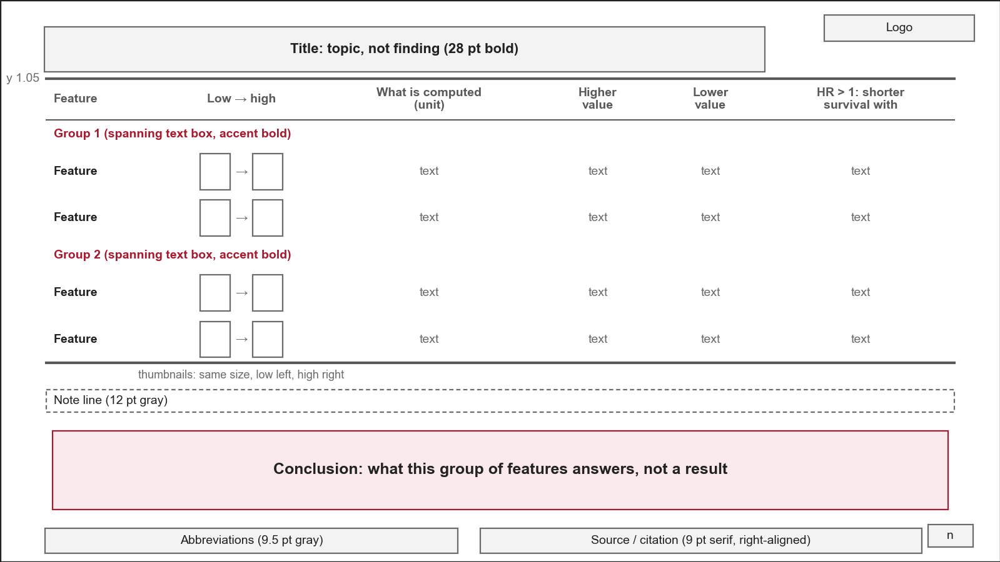

### Text / bullet slide

- **Use for**: background, problem statement, design notes, limitations.
- **Layout**: one bullet text box below the title (16–18 pt gray, the key phrase at the start of each item in bold), conclusion box at the bottom (y 5.95).
- **Rules**: one complete idea per item, 3–6 items; numbers still get a source (Source line or reference).

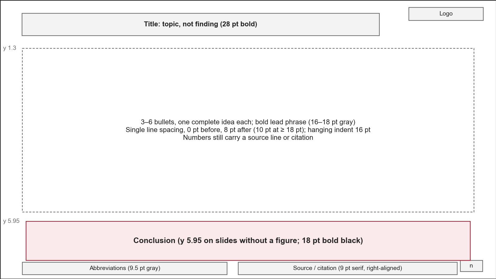

### Framework diagram / schematic

- **Use for**: an overview of the whole analysis (input → processing bands → output).
- **Layout**: built from native shapes and text boxes, not pasted as one whole image: each processing layer is a band with a light-gray fill, steps within a band are linked by thin gray arrows (`P.thinArrow()`),
  and flows into and out of the bands (inputs and outputs) use thick accent-color arrows (`P.thickArrow()`); when several rows share the same input or output, draw only one arrow, pointing at the middle.
- **Rules**: every small image and icon is a separate picture object and all text is native text boxes, so each can later be moved and edited on its own in PowerPoint.
  Use only openly licensed icons, and record their sources (see [figures.md](../../../shared/figures.md) §5–6).

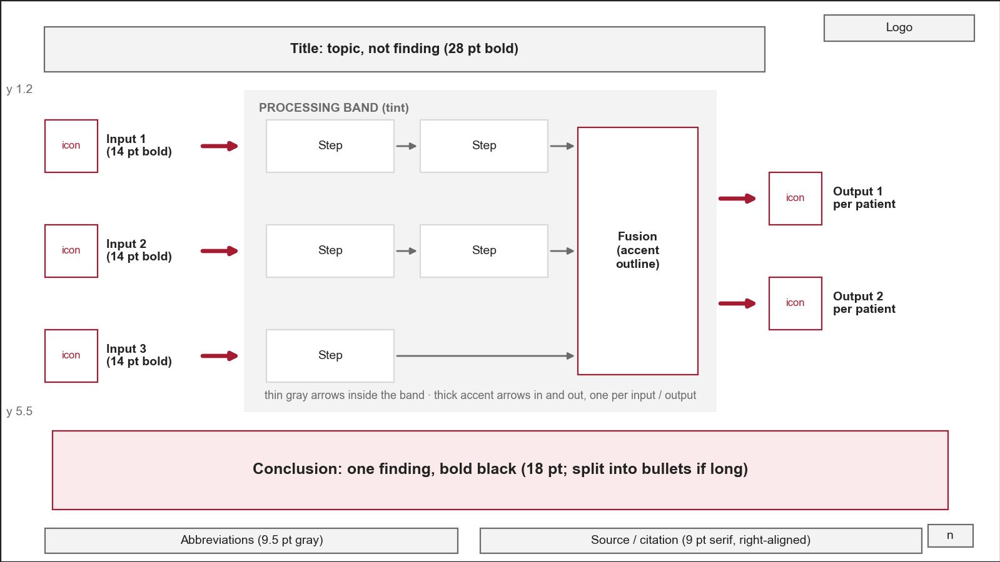

### Summary and limitations

- **Summary**: one row per line of evidence (one row per data type or per question), with a thin line between rows. Each row has a 24 pt bold accent-color name on the left with a 12 pt mid-gray n below it;
  on the right, one 17 pt bold claim followed by one or two gray sentences of evidence (with numbers). Every number must be findable on an earlier result slide.
- **Limitations**: a bullet slide (18 pt, a bold phrase at the start of each item naming the limitation); the conclusion sentence characterizes these results (e.g. *exploratory*) and says what is needed next.
- **Rules**: the summary contains no new numbers that were not shown before; wording follows the earlier result slides (candidate / nominal is not upgraded to significant).

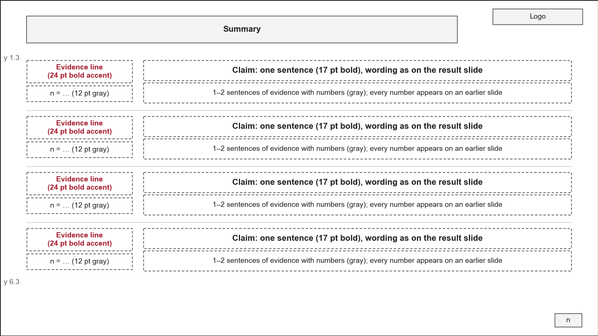

### Other common slide types

Geometry is taken from the page files of the example decks ([results](../../../examples/slides/results/slides/), [narrative](../../../examples/slides/narrative/slides/)); the key in the first column is the example page,
whose speaker notes (`notes/<key>.md`) say when to use it. On slides without a main figure, the conclusion box is always at y 5.95.

| Slide type | Use for | Layout |
|---|---|---|
| Agenda (narrative `sAgenda`) | After the title slide, and again at the start of each section | 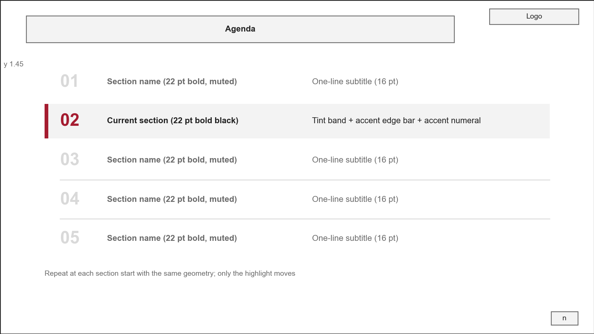 |
| Section divider (narrative `sSectionDivider`) | Between two sections | 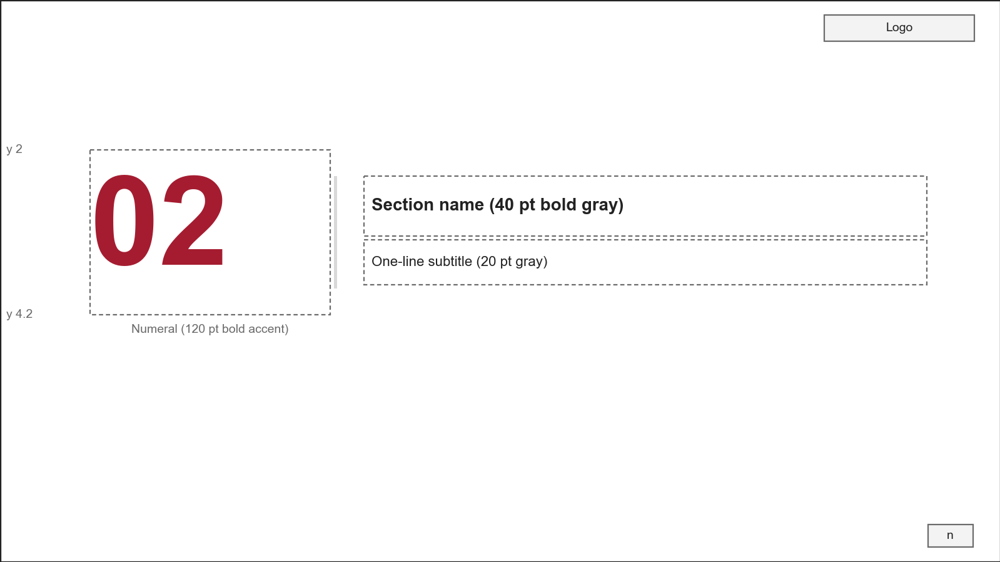 |
| One-sentence claim (narrative `sBigStatement`) | Start of the background, the one sentence the audience must accept first | 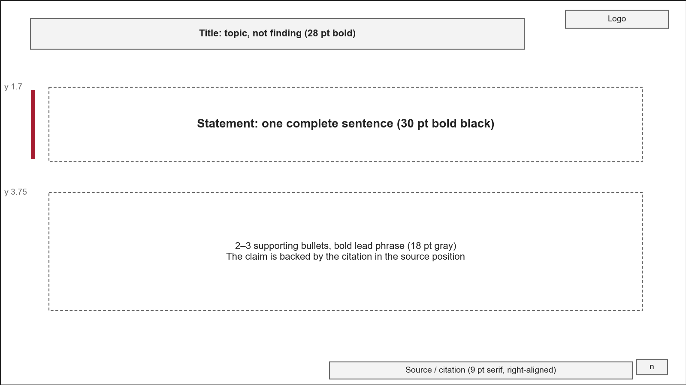 |
| Three columns: problem → approach → significance (narrative `sProblemApproachImpact`) | Study motivation | 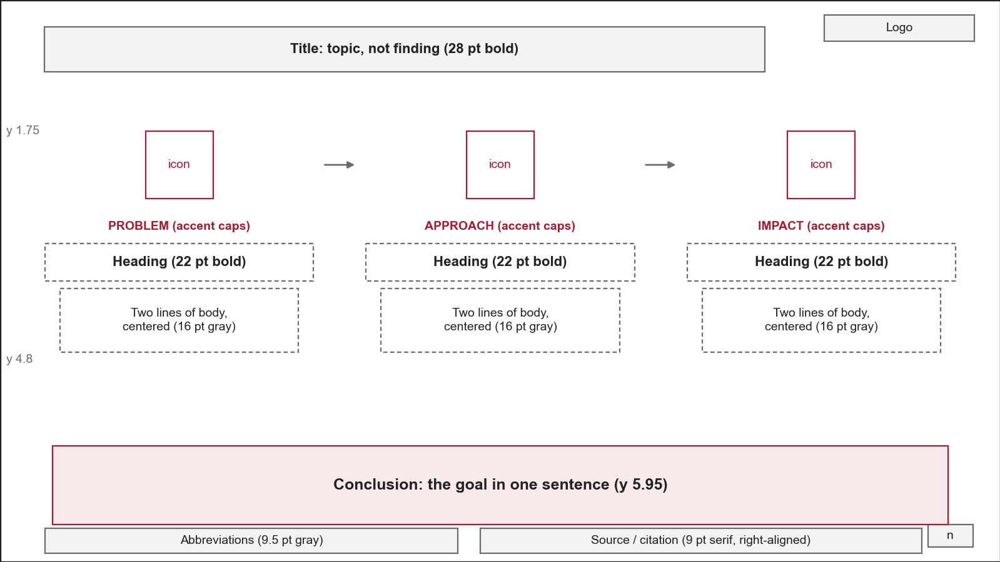 |
| Figure + reading points (results `sAucTakeaways`) | A half-width figure that needs two or three hints on how to read it | 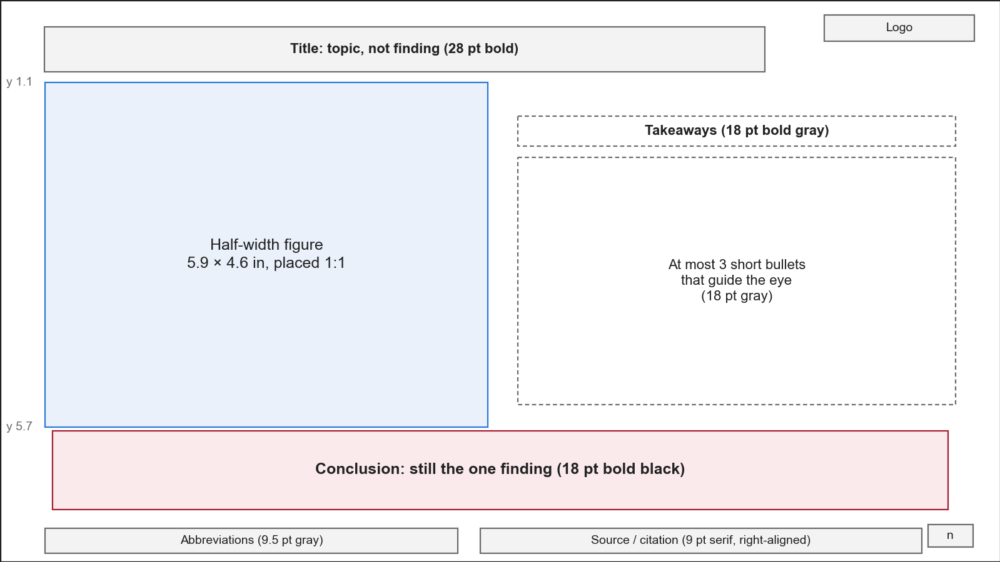 |
| Native three-line table (results `sCohortTable`) | Cohort tables, a few numbers to be read cell by cell | 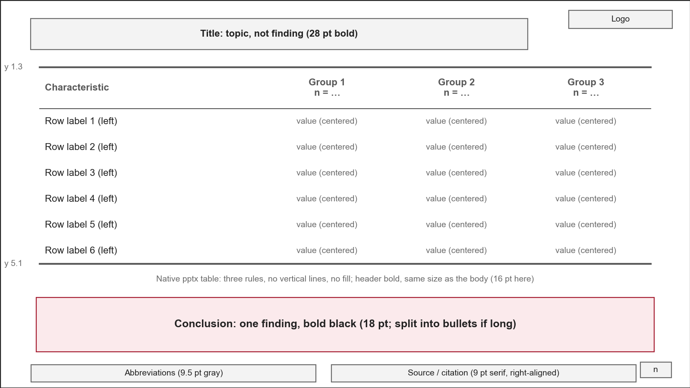 |
| Key numbers (results `sKeyNumbers`) | At the start of the results section, or the one slide of the deck to remember; at most three numbers | 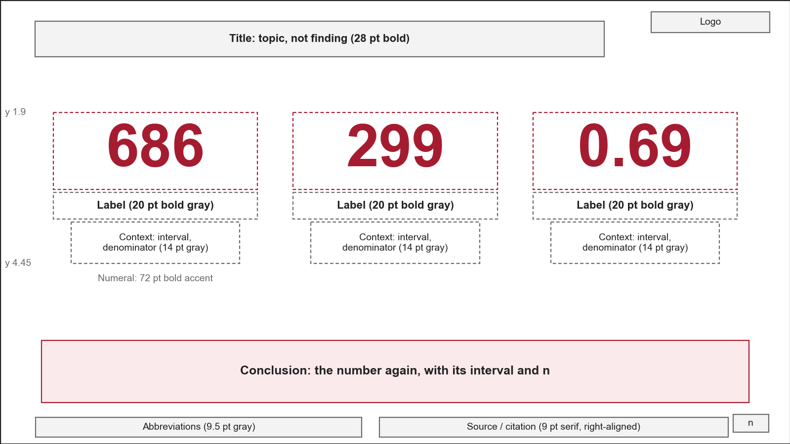 |
| Two-column comparison (narrative `sComparison`) | Existing methods vs this study, compared criterion by criterion | 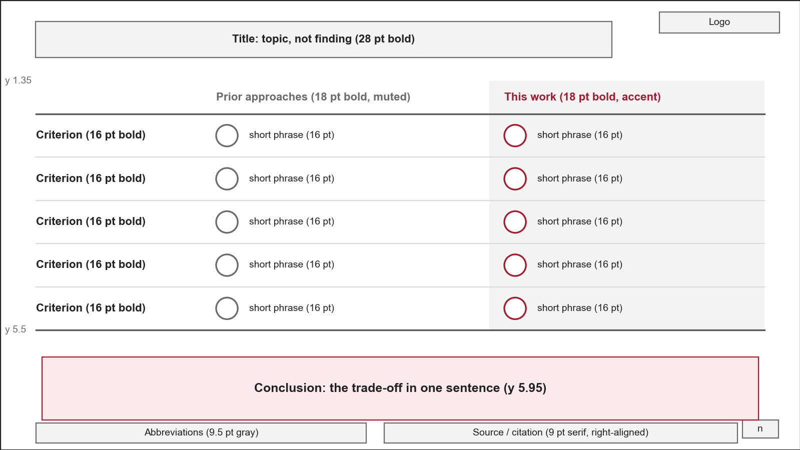 |

### Supplementary slides

- **Use for**: quality checks, secondary endpoints, sensitivity analyses, slides moved out of the main line that may still be asked about.
- **Naming**: the slide title is `Supplementary — <topic>`, the section key is `supplementary`; never called Backup.
- **Layout**: the same slide types as the main deck. The pages declare `section: "supplementary"`, the section that `supplementary` in `deck.config.js` names; it comes after the closing section in `sections` (a credits section may follow it, as in the narrative example).
- **Rules**: set to hidden in the pptx (skipped during the slideshow), still exported one page per slide in the PDF (how: see [checks.md](checks.md)).
  When the main deck's speaker notes mention a supplementary slide, they give its title, not "the next slide".

## 3. Slide chrome (chrome helpers)

The helpers in the table below are in [engine/js/primitives.js](../engine/js/primitives.js); page files call them as `P.<helper>`, and every size, font and box comes from the theme.

| helper | What it does | Format |
|---|---|---|
| `source(slide, s)` | Source line at the bottom right (box `geometry.source`) | `Source: GBSG2 trial (lifelines load_gbsg2); univariate Cox, recurrence-free survival` |
| `cite(slide, refs)` | Reference citation at the bottom right, taken from the registry `refs` in `deck.config.js` (`{key: [author, journal, rest, isOrg?]}`); `refs` is a key or a list of keys and `[prefix, key]` pairs (e.g. `["Figure: ", key]`), joined by semicolons | `Surname, Given, et al. ` + *Journal* + ` vol.issue (year): pages`; no `et al.` for institutional authors |
| `abbr(slide, entries, w, opts)` | Abbreviation line, `entries` = `[[abbr, expansion], …]` in the given order; `abbreviations(slide, x, y, w, h, entries)` is the older positional form with an explicit box | `HR: hazard ratio; CI: confidence interval; RFS: recurrence-free survival.` |
| `draft(slide)` | DRAFT label for ⚠️ slides (box `geometry.draft`) | `DRAFT – to be confirmed` |
| `table(slide, x, y, colW, rowH, rows, opts)` | The only entry point for native tables, three-line table | See [tables.md](../../../shared/tables.md) |
| `newSlide(pres, title, n, opts)` | Background, title, logo (the theme's `asset.logo`, or a gray `YOUR LOGO` placeholder), page number; records `{page, title}` in the page log that build.js writes to `pages.json`; `{chrome: false}` for title-type slides, `{logo: false}` without the logo | — |

- Each entry in the reference registry is checked only once (authors, journal, volume and issue, pages against the literature database's metadata); a new reference is added to the registry before it is used.
- The source line and references share the same position: when a slide has both data and references, combine them into one line separated by a semicolon (`P.citeRuns(s, ["Source: …; ", ...P.refRuns(key)])`); don't call both helpers (they would overlap).
