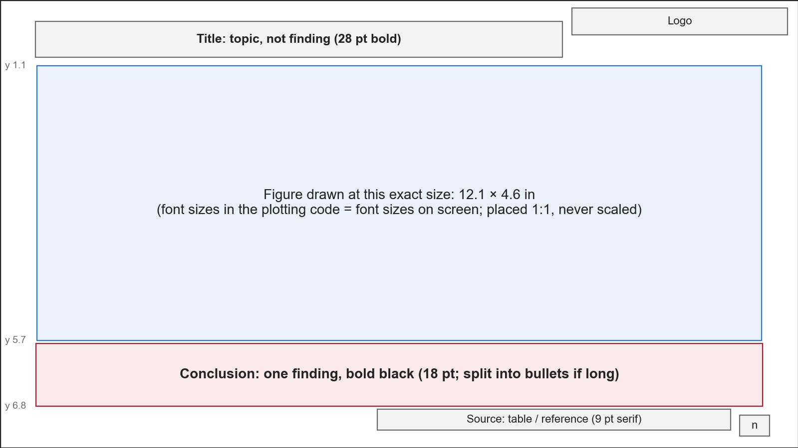

# 页面几何与页型

16:9，13.333 × 7.5 in（pptxgenjs `LAYOUT_WIDE`）。坐标单位都是英寸，原点在左上角。
下面的数字是默认值（[examples/slides/common.js](../../../examples/slides/common.js)），换模板时按模板量出来替换，但各区的上下次序和留白关系不变。

## 1. 几何

| 元素 | x | y | w × h | 字体与样式 |
|---|---|---|---|---|
| 页边距 / 内容宽 | 0.6 / — | — | 内容宽 12.133 | — |
| 标题 | 0.59 | 0.36 | 9.6 × 0.6 | 28 pt 粗体，灰（如 `595959`），标题字体；左上，止于 logo 左边 |
| logo | 10.98 | 0.2 | 2.0 × 0.35 | 右上，通用占位框；换成单位标识时按模板量出的框替换，没有标识就留空，不挪别的元素 |
| DRAFT 标签 | 10.683（= 13.333 − 2.65） | 0.66 | 2.35 × 0.32 | 浅灰底、细灰边，12 pt 粗体中灰，居中：`DRAFT – to be confirmed` |
| 主图（整宽） | 居中（≈ 0.617） | 1.1 | 12.1 × 4.6，止于 5.7 | 原尺寸放置：w = 像素宽 / dpi，h = 像素高 / dpi |
| 结论框 | 0.7 | 5.75（图下）/ 5.95（无图） | 11.933 × 1.05，有图时止于 6.80 | 18 pt 粗体黑色，顶对齐；放得下 3 行 |
| 结论列表 | 同上 | 同上 | 同上 | 每条悬挂缩进 22 pt（0.3 in），段后 10 pt |
| 来源行 / 文献 | 0.6 | ≥ 6.82 | 11.683 × 0.6 | 9 pt 衬线、近黑，右对齐、底对齐（文字落在约 7.1–7.4）；期刊名斜体 |
| 页码 | 12.363 | 7.0 | 0.6 × 0.3 | 12 pt 灰，右对齐，紧挨来源行右边 |
| 缩写行 | 按页放 | — | — | 9.5 pt 中灰，`ABBR: ` 粗体 |

- **正文 bullet**：单倍行距、段前 0、段后 8 pt；字号 ≥ 18 pt 时段后 10 pt。默认悬挂缩进 16 pt。
  行距和段前从不单独设，全稿一致。
- **没有主图的页**（文字页、总结页）结论框默认放在 y = 5.95；有图的页放在 5.75，紧贴图下边。
- **结论句太长**就拆成 bullet 列表，不缩字号（理由：结论字号各页一致）。
- **颜色**：标题和正文灰、表格与卡片正文近黑（`222222`）、次要文字中灰（`7F7F7F`）、细线浅灰（`D9D9D9`）、
  卡片底浅灰（`F3F3F3`）、白底，外加**一个**强调色（取模板或单位标识的主色；示例里的 `A51C30` 只是占位，换成模板主色）。
  这个强调色的浅色调（如 common.js 的 `accent2`–`accent4`）算同一个颜色。强调色只给步骤卡片头、分组标签、
  要强调的数字，不用来区分类别。
- **字体**：标题用模板的 display 字体，正文用模板的无衬线字体，来源行和文献用衬线字体。都写成常量，各 builder 不自己设。
- **图的 dpi** 在画图和构建两边用同一个常量（如 200）：构建按「像素 / dpi」算放置尺寸，两边不一致图就被缩放了。
- **z 序**：主图加完后放到本页最底（「置于底层」），同页多张图保持彼此顺序。标题在别的字体下折成两行时就不会被图盖住。
  卡片上的图标、步骤小图、logo 这类本来就该在形状上面的图不动。

## 2. 页型

每个页型在 `primitives.js` 里是一个模板函数，builder 只填内容。新页型先放在自己的 `slides_<block>.js` 里，用过两次再并进共享文件。

### 标题页 / 结束页

- **用于**：第一页（题目、讲者、日期）；结束页（`Thank you`）用同一个框架。
- **版式**：logo 在左上；题目居中，放在一条横向区带里，左侧一根竖的强调色细条（约 0.1 × 1.86 in），
  页底一条整宽强调色细线（约 y 6.83，高 0.05）；讲者和日期在题目下方右对齐。
- **规则**：讲者姓名只出现在这里（和文献引用的作者）。题目可以两行，用软换行，不用两个段落。这两页不进页码系统，标题记作 `Title`、`Thank you`。

### 图 + 结论（最常用）

- **用于**：一张整宽结果图（森林图、KM、热图、柱图）。
- **版式**：标题 → 主图（y 1.1，原尺寸，居中）→ 结论框（y 5.75）→ 来源行 → 页码；⚠️ 页加 DRAFT 标签。
- **规则**：图按 12.1 × 4.6 in 画（见 [figures.md](../../../shared/figures.md)）。标题折行压到图时，用参数把图和结论框整体下移，
  不缩图。图里已经写了的数字，结论句只挑一两个讲。

### 两张图并排

- **用于**：同一问题的两个视角（两个终点、两种模型），左右对照。
- **版式**：两张图各按 5.9 × 4.6 in 画，间隔 0.2 in，作为一组水平居中，都放原尺寸。
- **规则**：两张图的高度、字号、坐标轴范围（能对齐的话）一致；不要把一张整宽图缩成半宽放。

### KM 网格（两行终点）

- **用于**：同一批变量对两个终点（如上行 PFS、下行 OS），每列一个变量。
- **版式**：图从 y 0.95 起，高 4.9 in（比整宽图多 0.3 in），结论框下移到 y 5.87。
- **规则**：所有面板是同样大小的正方形，两行共用一条 x 轴范围；每格写 HR [95% CI]、Cox p、C-index、log-rank p
  （见 [figures.md](../../../shared/figures.md) §4）。标题必须一行放得下，否则会压进图里。

### 方法流程

- **用于**：方法、处理流程、模型训练步骤。
- **版式**：一行步骤卡片，卡片之间间隔 0.32 in，中间一个小的右向箭头（高 0.24 in）。
  每张卡片：强调色的头（高 0.42 in，白色 14 pt 粗体 `1 · Step name`）+ 浅灰底的正文（13 pt 近黑，段后 6 pt）。
  卡片行 y 1.3、高 2.3；下面是定义和注意事项的 bullet（y 3.85，14 pt）；底部结论框。
- **每步配一张图（可选）**：画一张和卡片行等宽的图，每格一个小图（同一个样本贯穿各步最好），
  原尺寸放在卡片头和正文之间；卡片行改为 y 1.05、高 3.95，正文 12 pt、段后 3 pt，bullet 下移到 y 5.05。
- **规则**：步骤 3–5 个；每步的正文写「做了什么 + 关键参数」，不写结果；结果留给后面的结果页。

### 特征定义表

- **用于**：一组特征第一次出现时，告诉听众每个特征怎么算、高低意味着什么。
- **版式**：一张三线表，从 y 1.05 起，列为

  | Feature | Low → high | What is computed (unit) | Higher value | Lower value | HR > 1: shorter survival with |
  |---|---|---|---|---|---|

  第二列放每个特征一张小示意图（左边低值、右边高值），由画图脚本统一画成同样大小，作为独立图片盖在该格上，
  格子放不下才按比例缩小（这类小示意图算缩略图；结果图从不缩放）。最后一列的表头按终点改写。
- **分组行**：表里插一个空行，再在上面盖一个横跨整行的文本框，强调色粗体写组名（不挤在第一列里折行）。
- **行高**：按每格文字的贪心折行估算（字符宽度按较宽的替代字体取，粗体再宽约 18%），再和图标高度取大，
  所以两种渲染器里每张图标都落在自己那一行。表框高度 = 各行行高之和。
- **规则**：表下可以有一行 12 pt 中灰的说明；结论句写「这组特征回答什么问题」，不写结果。

### 文字 / bullet 页

- **用于**：背景、问题陈述、设计说明、局限。
- **版式**：标题下一个 bullet 文本框（16–18 pt 灰，每条开头的关键短语加粗），底部结论框（y 5.95）。
- **规则**：每条一个完整的意思，3–6 条；数字照样写来源（Source 行或文献引用）。

### 框架图 / 示意图

- **用于**：整套分析的总览（输入 → 处理带 → 输出）。
- **版式**：用原生形状和文本框搭，不贴一整张图：每层处理是一条浅灰底的带，带内步骤用细灰线箭头串起，
  带外表示输入输出的流向用粗的强调色箭头；多行共用同一个输入或输出时只画一个箭头指向中间。
- **规则**：每个小图、图标是单独的图片对象，文字是原生文本框，以后能在 PowerPoint 里单独挪、单独改。
  图标只用开放许可的，并登记出处（见 [figures.md](../../../shared/figures.md) §5–6）。

### 总结与局限

- **总结**：一行一条证据线（每种数据或每个问题一行），行之间一条细线。每行左边强调色 24 pt 粗体的名字，下面 12 pt 中灰的 n；
  右边一句 17 pt 粗体的主张，再一两句灰色的证据（带数字）。每个数字都要能在前面的结果页找到。
- **局限**：bullet 页（18 pt，每条开头的粗体短语点出局限是什么），结论句写这些结果的定性（如 *exploratory*）和下一步需要什么。
- **规则**：总结里不出现前面没讲过的新数字；措辞照前面结果页的口径（candidate / nominal 不升级成 significant）。

### Supplementary 页

- **用于**：质量检查、次要终点、敏感性分析、被挪出主线但可能被问到的页。
- **命名**：页标题写 `Supplementary — <主题>`，节 key 用 `supplementary`；不叫 Backup。
- **版式**：和主稿同样的页型。放在 `SLIDES` 最后一节 `supplementary`，排在结束页之后。
- **规则**：在 pptx 里设成隐藏（放映时跳过），PDF 里照样每页导出（做法见 [checks.md](checks.md)）。
  主稿讲稿里提到 supplementary 页时写它的标题，不写「下一页」。

## 3. 页面附件（chrome helper）

下表的 helper 在 [examples/slides/common.js](../../../examples/slides/common.js) 里有，标「项目侧 / 第二期 engine 提供」的除外：那些 common.js 还没有，先在项目里自己写。

| helper | 做什么 | 格式 |
|---|---|---|
| `source(slide, s)` | 右下角来源行 | `Source: GBSG2 trial (lifelines load_gbsg2); univariate Cox, recurrence-free survival` |
| `cite(slide, keys)`（项目侧 / 第二期 engine 提供） | 右下角文献引用，从登记表 `REF`（同样项目侧 / 第二期 engine 提供）取，多条用分号隔开，可带前缀（`Figure: `） | `Surname, Given, et al. ` + *Journal* + ` vol.issue (year): pages`；机构作者不加 `et al.` |
| `abbreviations(slide, …, entries)` | 缩写行，按给定顺序；条目少时可一条一行 | `HR: hazard ratio; CI: confidence interval; RFS: recurrence-free survival.` |
| `draft(slide)` | ⚠️ 页的 DRAFT 标签 | `DRAFT – to be confirmed` |
| `table(slide, x, y, colW, rowH, rows)` | 唯一的原生表格入口，三线表 | 见 [tables.md](../../../shared/tables.md) |
| `newSlide(pres, title, n)` | 白底、标题、logo 占位、页码；把标题记进页表（写 `pages.json` 用）这一步是项目侧 / 第二期 engine 提供 | — |

- 文献登记表里每条只核对一次（作者、期刊、卷期、页码按文献数据库元数据），新文献先加进登记表再用。
- 来源行和文献共用同一个位置：一页既有数据又有文献时合成一行、用分号隔开，不要两个 helper 都调（会叠在一起）。
